# Histogramme

Die folgenden Histogramme dürfen frei verwendet werden. Ich stelle diese parallel zur MIT-Lizenz auch unter CC0 1.0 Universal zur Verfügung.

Histogramm der Programmiersprachen by Thomas Schubert is marked CC0 1.0 Universal. To view a copy of this mark, visit https://creativecommons.org/publicdomain/zero/1.0/

## Histogramm der Programmiersprachen

```mermaid
flowchart TB

%% =========================================================
%% Jahrzehnte und Programmiersprachen
%% =========================================================

subgraph Y1940["1940er Jahre"]
    direction TB
    T1940["1940"]
    PLANKALKUEL["Plankalkuel (1948)"]
end

subgraph Y1950["1950er Jahre"]
    direction TB
    T1950["1950"]
    FORTRAN["FORTRAN (1957)"]
    LISP["Lisp (1958)"]
end

subgraph Y1960["1960er Jahre"]
    direction TB
    T1960["1960"]
    ALGOL["ALGOL 60 (1960)"]
    COBOL["COBOL (1960)"]
    BASIC["BASIC (1964)"]
    SIMULA["Simula (1967)"]
    LOGO["Logo (1967)"]
end

subgraph Y1970["1970er Jahre"]
    direction TB
    T1970["1970"]
    PASCAL["Pascal (1970)"]
    FORTH["Forth (1970)"]
    SMALLTALK["Smalltalk (1972)"]
    C["C (1972)"]
    PROLOG["Prolog (1972)"]
    SQL["SQL (1974)"]
    SCHEME["Scheme (1975)"]
    ML["ML (1977)"]
end

subgraph Y1980["1980er Jahre"]
    direction TB
    T1980["1980"]
    ADA["Ada (1983)"]
    OBJECTIVEC["Objective-C (1984)"]
    CPP["C++ (1985)"]
    ERLANG["Erlang (1986)"]
    PERL["Perl (1987)"]
    TCL["Tcl (1988)"]
end

subgraph Y1990["1990er Jahre"]
    direction TB
    T1990["1990"]
    HASKELL["Haskell (1990)"]
    PYTHON["Python (1991)"]
    VB["Visual Basic (1991)"]
    LUA["Lua (1993)"]
    R["R (1993)"]
    RUBY["Ruby (1995)"]
    JAVA["Java (1995)"]
    JAVASCRIPT["JavaScript (1995)"]
    PHP["PHP (1995)"]
    DELPHI["Delphi (1995)"]
    OCAML["OCaml (1996)"]
end

subgraph Y2000["2000er Jahre"]
    direction TB
    T2000["2000"]
    CSHARP["C# (2000)"]
    SCALA["Scala (2004)"]
    FSHARP["F# (2005)"]
    POWERSHELL["PowerShell (2006)"]
    CLOJURE["Clojure (2007)"]
    GO["Go (2009)"]
end

subgraph Y2010["2010er Jahre"]
    direction TB
    T2010["2010"]
    RUST["Rust (2010)"]
    KOTLIN["Kotlin (2011)"]
    TYPESCRIPT["TypeScript (2012)"]
    JULIA["Julia (2012)"]
    ELIXIR["Elixir (2012)"]
    SWIFT["Swift (2014)"]
    ZIG["Zig (2016)"]
end

subgraph Y2020["2020er Jahre"]
    direction TB
    T2020["2020"]
    MOJO["Mojo (2023)"]
end

%% =========================================================
%% Zeitachse
%% =========================================================

T1940 -.-> T1950
T1950 -.-> T1960
T1960 -.-> T1970
T1970 -.-> T1980
T1980 -.-> T1990
T1990 -.-> T2000
T2000 -.-> T2010
T2010 -.-> T2020

%% =========================================================
%% Abstammung oder direkte Sprachfamilie
%% =========================================================

ALGOL --> PASCAL
ALGOL --> C
ALGOL --> SIMULA

SIMULA --> SMALLTALK

C --> CPP
C --> OBJECTIVEC

PASCAL --> DELPHI

LISP --> SCHEME
LISP --> CLOJURE

BASIC --> VB

ML --> HASKELL
ML --> OCAML

OCAML --> FSHARP

OBJECTIVEC --> SWIFT

JAVA --> KOTLIN

JAVASCRIPT --> TYPESCRIPT

ERLANG --> ELIXIR

%% =========================================================
%% Einfluss
%% =========================================================

PLANKALKUEL --> ALGOL

FORTRAN --> BASIC
FORTRAN --> R
FORTRAN --> JULIA

LISP --> LOGO
LISP --> ML
LISP --> RUBY

ALGOL --> ADA

SIMULA --> CPP

SMALLTALK --> OBJECTIVEC
SMALLTALK --> RUBY
SMALLTALK --> JAVA
SMALLTALK --> JAVASCRIPT

C --> JAVA
C --> CSHARP
C --> GO
C --> RUST
C --> ZIG
C --> JAVASCRIPT
C --> PHP

CPP --> JAVA
CPP --> CSHARP
CPP --> RUST

JAVA --> CSHARP
JAVA --> SCALA
JAVA --> CLOJURE

SCHEME --> JAVASCRIPT

ML --> SCALA
ML --> RUST
ML --> SWIFT

HASKELL --> SCALA

PROLOG --> ERLANG
ADA --> ERLANG

ERLANG --> SCALA
ERLANG --> GO

PERL --> PYTHON
PERL --> PHP
PERL --> RUBY

TCL --> LUA

PYTHON --> JULIA
PYTHON --> MOJO

RUBY --> ELIXIR

CSHARP --> POWERSHELL

SCALA --> KOTLIN

RUST --> MOJO
SWIFT --> MOJO

%% =========================================================
%% Gestaltung
%% =========================================================

classDef timelineAnchor fill:none,stroke:none,color:transparent;
class T1940,T1950,T1960,T1970,T1980,T1990,T2000,T2010,T2020 timelineAnchor;

linkStyle default stroke:#111111,stroke-width:1.5px;

linkStyle 0,1,2,3,4,5,6,7 stroke:#888888,stroke-width:1.5px,stroke-dasharray:6 4;

linkStyle 8,9,10,11,12,13,14,15,16,17,18,19,20,21,22,23,24 stroke:#228B22,stroke-width:2px;

style Y1940 fill:#f7f7f7,stroke:#aaaaaa
style Y1950 fill:#f7f7f7,stroke:#aaaaaa
style Y1960 fill:#f7f7f7,stroke:#aaaaaa
style Y1970 fill:#f7f7f7,stroke:#aaaaaa
style Y1980 fill:#f7f7f7,stroke:#aaaaaa
style Y1990 fill:#f7f7f7,stroke:#aaaaaa
style Y2000 fill:#f7f7f7,stroke:#aaaaaa
style Y2010 fill:#f7f7f7,stroke:#aaaaaa
style Y2020 fill:#f7f7f7,stroke:#aaaaaa
```

