# Histogramme

Die folgenden Historgramme dürfen frei verwendet werden, ich stelle diese parallel zur MIT Lizenz auch als CC0 1.0 Universal zur Verfügung
Histogramm der Programmiersprachen  by Thomas Schubert is marked CC0 1.0 Universal. To view a copy of this mark, visit https://creativecommons.org/publicdomain/zero/1.0/

## Histogramm der Programmiersprachen

```mermaid
flowchart TB

  %% =========================================================
  %% 1940er Jahre
  %% =========================================================

  subgraph Y1940["1940er Jahre"]
      PLANKALKUEL["Plankalkül<br/>1948<br/>Variablen · Arrays · strukturierte Daten"]
  end


  %% =========================================================
  %% 1950er Jahre
  %% =========================================================

  subgraph Y1950["1950er Jahre"]
      FORTRAN["FORTRAN<br/>1957<br/>Compiler · Schleifen · numerisches Rechnen"]

      LISP["Lisp<br/>1958<br/>Listen · Rekursion · Garbage Collection<br/>Homoikonizität"]
  end


  %% =========================================================
  %% 1960er Jahre
  %% =========================================================

  subgraph Y1960["1960er Jahre"]
      ALGOL["ALGOL 60<br/>1960<br/>Blockstruktur · lokale Variablen · BNF"]

      COBOL["COBOL<br/>1960<br/>Geschäftsanwendungen · lesbare Syntax<br/>Datensatzverarbeitung"]

      BASIC["BASIC<br/>1964<br/>Einfache interaktive Programmierung<br/>Ausbildung"]

      SIMULA["Simula<br/>1967<br/>Klassen · Objekte · Vererbung"]

      LOGO["Logo<br/>1967<br/>Lernen · Turtle Graphics · Lisp-Ideen"]
  end


  %% =========================================================
  %% 1970er Jahre
  %% =========================================================

  subgraph Y1970["1970er Jahre"]
      PASCAL["Pascal<br/>1970<br/>Strukturierte Programmierung<br/>starke Typisierung"]

      FORTH["Forth<br/>1970<br/>Stack-basiert · interaktiv · kompakt"]

      SMALLTALK["Smalltalk<br/>1972<br/>Reine Objektorientierung<br/>Message Passing · IDE"]

      C["C<br/>1972<br/>Systemprogrammierung · Pointer<br/>portable Betriebssysteme"]

      PROLOG["Prolog<br/>1972<br/>Logikprogrammierung · Regeln<br/>Unifikation · Backtracking"]

      SQL["SQL<br/>1974<br/>Deklarative Datenabfragen<br/>relationale Datenbanken"]

      SCHEME["Scheme<br/>1975<br/>Minimalistisches Lisp · Closures<br/>lexikalischer Scope"]

      ML["ML<br/>1977<br/>Typinferenz · algebraische Datentypen<br/>Pattern Matching"]
  end


  %% =========================================================
  %% 1980er Jahre
  %% =========================================================

  subgraph Y1980["1980er Jahre"]
      ADA["Ada<br/>1983<br/>Starke Typisierung · Modularität<br/>Nebenläufigkeit"]

      OBJECTIVEC["Objective-C<br/>1984<br/>C · Smalltalk-Nachrichten<br/>dynamische Laufzeit"]

      CPP["C++<br/>1985<br/>Objektorientierung · Templates<br/>RAII"]

      ERLANG["Erlang<br/>1986<br/>Actor-Modell · Fehlertoleranz<br/>verteilte Systeme"]

      PERL["Perl<br/>1987<br/>Textverarbeitung · reguläre Ausdrücke<br/>Skripting"]

      TCL["Tcl<br/>1988<br/>Einbettbare Skriptsprache<br/>alles ist ein String"]
  end


  %% =========================================================
  %% 1990er Jahre
  %% =========================================================

  subgraph Y1990["1990er Jahre"]
      HASKELL["Haskell<br/>1990<br/>Rein funktional · Lazy Evaluation<br/>Typklassen"]

      PYTHON["Python<br/>1991<br/>Lesbarkeit · dynamische Typisierung<br/>Mehrparadigmenansatz"]

      VB["Visual Basic<br/>1991<br/>Rapid Application Development<br/>ereignisgesteuerte GUIs"]

      LUA["Lua<br/>1993<br/>Leichtgewichtig · einbettbar<br/>Tabellen als zentrale Struktur"]

      R["R<br/>1993<br/>Statistik · Vektorisierung<br/>Datenanalyse"]

      RUBY["Ruby<br/>1995<br/>Objektorientierung · Blöcke<br/>Metaprogrammierung"]

      JAVA["Java<br/>1995<br/>JVM · Garbage Collection<br/>plattformunabhängiger Bytecode"]

      JAVASCRIPT["JavaScript<br/>1995<br/>Prototypen · Closures<br/>Webprogrammierung"]

      PHP["PHP<br/>1995<br/>Serverseitige Webentwicklung<br/>HTML-Einbettung"]

      DELPHI["Delphi / Object Pascal<br/>1995<br/>RAD · Komponenten · GUI-Entwicklung"]

      OCAML["OCaml<br/>1996<br/>Funktional · objektorientiert<br/>Typinferenz · Module"]
  end


  %% =========================================================
  %% 2000er Jahre
  %% =========================================================

  subgraph Y2000["2000er Jahre"]
      CSHARP["C#<br/>2000<br/>.NET · Managed Code · Properties<br/>Delegates · LINQ"]

      SCALA["Scala<br/>2004<br/>Objektorientiert · funktional<br/>JVM · Pattern Matching"]

      FSHARP["F#<br/>2005<br/>Funktional auf .NET<br/>Typinferenz · Async Workflows"]

      POWERSHELL["PowerShell<br/>2006<br/>Objektbasierte Shell<br/>Pipelines · .NET-Integration"]

      CLOJURE["Clojure<br/>2007<br/>Lisp auf der JVM · Immutability<br/>Software Transactional Memory"]

      GO["Go<br/>2009<br/>Einfachheit · Goroutines · Channels<br/>schnelle Kompilierung"]
  end


  %% =========================================================
  %% 2010er Jahre
  %% =========================================================

  subgraph Y2010["2010er Jahre"]
      RUST["Rust<br/>2010<br/>Memory Safety · Ownership · Borrowing<br/>keine Garbage Collection"]

      KOTLIN["Kotlin<br/>2011<br/>Null-Sicherheit · JVM-Interop<br/>Coroutines"]

      TYPESCRIPT["TypeScript<br/>2012<br/>Statische Typisierung für JavaScript<br/>Structural Typing"]

      JULIA["Julia<br/>2012<br/>Wissenschaftliches Rechnen<br/>Multiple Dispatch · JIT"]

      ELIXIR["Elixir<br/>2012<br/>Erlang VM · Actor-Modell<br/>fehlertolerante Anwendungen"]

      SWIFT["Swift<br/>2014<br/>Optionals · Value Types<br/>Protocol-oriented Programming"]

      ZIG["Zig<br/>2016<br/>Systemprogrammierung · manuelle Speicherverwaltung<br/>Comptime"]
  end


  %% =========================================================
  %% 2020er Jahre
  %% =========================================================

  subgraph Y2020["2020er Jahre"]
      MOJO["Mojo<br/>2023<br/>Python-nahe Syntax · Ownership-Ideen<br/>KI · HPC · Hardwareoptimierung"]
  end


  %% =========================================================
  %% Zeitachse und Layout-Hilfen
  %% =========================================================

  Y1940 -.-> Y1950
  Y1950 -.-> Y1960
  Y1960 -.-> Y1970
  Y1970 -.-> Y1980
  Y1980 -.-> Y1990
  Y1990 -.-> Y2000
  Y2000 -.-> Y2010
  Y2010 -.-> Y2020


  %% =========================================================
  %% Frühe Einflüsse
  %% =========================================================

  PLANKALKUEL -.->|"historischer Vorläufer"| ALGOL

  FORTRAN --> BASIC
  FORTRAN -.->|"numerisches Rechnen"| JULIA

  LISP --> LOGO
  LISP --> SCHEME
  LISP --> ML
  LISP --> CLOJURE
  LISP -.->|"funktionale Konzepte"| HASKELL
  LISP -.->|"dynamische Sprache"| RUBY


  %% =========================================================
  %% ALGOL-, Pascal- und C-Familie
  %% =========================================================

  ALGOL --> SIMULA
  ALGOL --> PASCAL
  ALGOL --> C
  ALGOL -.->|"Blockstruktur"| ADA

  PASCAL --> ADA
  PASCAL --> DELPHI

  SIMULA --> SMALLTALK
  SIMULA --> CPP

  C --> CPP
  C --> OBJECTIVEC
  C --> JAVA
  C --> CSHARP
  C --> GO
  C --> RUST
  C --> ZIG
  C -.->|"Syntax"| JAVASCRIPT
  C -.->|"Syntax"| PHP
  C -.->|"Systemnähe"| SWIFT

  SMALLTALK --> OBJECTIVEC
  SMALLTALK --> RUBY
  SMALLTALK -.->|"Objektmodell"| JAVA
  SMALLTALK -.->|"Nachrichten und Dynamik"| JAVASCRIPT

  OBJECTIVEC --> SWIFT

  CPP --> JAVA
  CPP --> CSHARP
  CPP -.->|"Generics und Systemkonzepte"| RUST

  JAVA --> CSHARP
  JAVA --> SCALA
  JAVA --> KOTLIN
  JAVA --> CLOJURE

  JAVASCRIPT --> TYPESCRIPT


  %% =========================================================
  %% Funktionale Sprachfamilie
  %% =========================================================

  SCHEME -.->|"Closures und funktionaler Stil"| JAVASCRIPT

  ML --> HASKELL
  ML --> OCAML
  ML --> FSHARP
  ML -.->|"Typensystem"| SCALA
  ML -.->|"Pattern Matching"| RUST
  ML -.->|"Option Types"| SWIFT

  OCAML --> FSHARP
  HASKELL -.->|"Typklassen und funktionale Konzepte"| SCALA


  %% =========================================================
  %% Nebenläufigkeit und verteilte Systeme
  %% =========================================================

  PROLOG -.->|"Pattern Matching und symbolische Verarbeitung"| ERLANG
  ADA -.->|"Nebenläufigkeit"| ERLANG

  ERLANG --> ELIXIR
  ERLANG -.->|"Actor-Modell"| SCALA
  ERLANG -.->|"leichtgewichtige Prozesse"| GO

  CSP["CSP<br/>1978<br/>Kommunizierende sequenzielle Prozesse"]:::concept
  CSP -.->|"Channels"| GO
  CSP -.->|"Nebenläufigkeitsmodell"| ERLANG


  %% =========================================================
  %% Skript- und Anwendungssprachen
  %% =========================================================

  BASIC --> VB

  PERL -.->|"Skripting und Textverarbeitung"| PYTHON
  PERL -.->|"Web-Skripting"| PHP
  PERL -.->|"reguläre Ausdrücke"| RUBY

  TCL -.->|"Einbettbarkeit"| LUA

  PYTHON -.->|"Syntax und Bedienbarkeit"| JULIA
  PYTHON -.->|"Python-Kompatibilität"| MOJO

  RUBY -.->|"Blöcke und Entwicklerfreundlichkeit"| ELIXIR


  %% =========================================================
  %% Datenbanken und Datenanalyse
  %% =========================================================

  SQL -.->|"deklarative Abfragen"| R

  FORTRAN -.->|"wissenschaftliches Rechnen"| R
  FORTRAN -.->|"wissenschaftliches Rechnen"| JULIA


  %% =========================================================
  %% Moderne Sprachkonzepte
  %% =========================================================

  CSHARP --> POWERSHELL
  CSHARP -.->|"Async und moderne Syntax"| KOTLIN

  SCALA -.->|"funktionale JVM-Sprache"| KOTLIN

  RUST -.->|"Ownership und Memory Safety"| MOJO

  SWIFT -.->|"moderne sichere Systemkonzepte"| MOJO


  %% =========================================================
  %% Gestaltung
  %% =========================================================

  classDef concept fill:#f4f4f4,stroke:#777,stroke-dasharray:5 5

  style Y1940 fill:#f8f8f8
  style Y1950 fill:#f8f8f8
  style Y1960 fill:#f8f8f8
  style Y1970 fill:#f8f8f8
  style Y1980 fill:#f8f8f8
  style Y1990 fill:#f8f8f8
  style Y2000 fill:#f8f8f8
  style Y2010 fill:#f8f8f8
  style Y2020 fill:#f8f8f8

```

